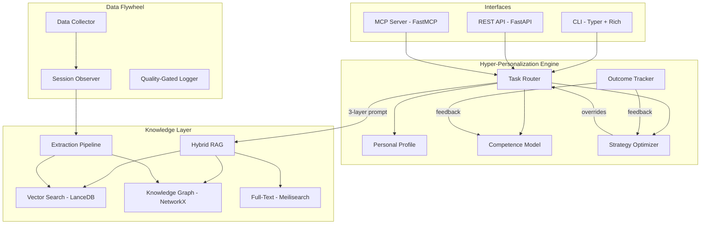
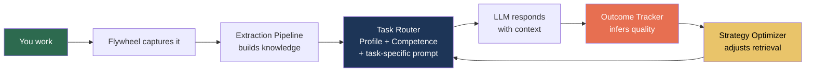

# Fabrik-Codek

**A local AI assistant that learns how you work**

[](https://www.python.org/downloads/)
[](LICENSE)
[]()

> A 7B model that knows you is worth more than a 400B that doesn't.

Fabrik-Codek is a **personal cognitive architecture** that runs locally with any Ollama model. It builds a knowledge graph from how you work, profiles your expertise, and adapts its retrieval and response strategy over time — all without sending data anywhere.

It's not just RAG. It's a closed feedback loop: capture your work, extract knowledge, measure competence, route tasks intelligently, observe outcomes, and refine.

## Quick Start

```bash
git clone https://github.com/ikchain/Fabrik-Codek.git
cd fabrik-codek
pip install -e ".[dev]"
fabrik init
```

`fabrik init` checks your Python version, detects Ollama, creates a `.env` config, sets up data directories, and downloads the required models.

```bash
fabrik chat                              # Interactive chat
fabrik ask "How do I implement a repository pattern?" --rag   # Single question with RAG
fabrik ask "Optimize this SQL query" --graph                  # Hybrid RAG (vector + graph)
fabrik status                            # System health
```

> **Prerequisite**: [Ollama](https://ollama.ai/) must be installed and running. Works with Qwen, Llama, DeepSeek, Codestral, Phi, Mistral, and any other Ollama model. Switch models with `--model` or in `.env`.

## What Makes It Different

Most local AI tools are stateless wrappers around an LLM. Fabrik-Codek is **stateful and adaptive**:

| Capability | What it means |
|-----------|--------------|
| **Learns your domain** | Analyzes your datalake to build a Personal Profile — your stack, patterns, and preferences become the system prompt |
| **Measures your expertise** | Competence Model scores knowledge depth per topic (Expert/Competent/Novice/Unknown) using 4 signals with graceful degradation |
| **Routes tasks intelligently** | Adaptive Task Router classifies queries, selects the right model, and adapts retrieval strategy per task type |
| **Observes outcomes** | Outcome Tracker infers response quality from conversational patterns — zero friction, no thumbs up/down |
| **Self-corrects** | Strategy Optimizer adjusts retrieval parameters for underperforming topic/task combinations |
| **Keeps knowledge fresh** | Graph Temporal Decay fades stale knowledge; Semantic Drift Detection alerts when contexts shift |
| **Domain-agnostic** | Works for any profession. A lawyer's datalake produces a legal profile. A trader's datalake produces a trading profile |

## Architecture



### The Cognitive Loop



Every interaction feeds back into the system. The more you use it, the better it gets — not through fine-tuning, but through smarter retrieval and routing.

## Features

### Knowledge & Retrieval

- **Three-Tier Hybrid RAG** — Vector search (LanceDB) + knowledge graph traversal (NetworkX) + full-text search (Meilisearch), fused with Reciprocal Rank Fusion
- **Knowledge Graph** — Automatically extracts entities and relationships from training data, code changes, and session transcripts
- **11-Step Extraction Pipeline** — From raw data through graph completion, temporal decay, alias deduplication, drift detection, and neighborhood snapshots
- **Graph Temporal Decay** — `weight = base * 0.5^(days/half_life)` keeps knowledge fresh
- **Semantic Drift Detection** — Jaccard similarity on neighbor sets between builds; alerts when an entity's context shifts
- **Graph Completion** — Infers transitive relationships to densify the graph
- **Full-Text Search** — Optional Meilisearch for BM25-style keyword search; degrades gracefully when unavailable

### Personalization

- **Personal Profile** — Learns your domain, stack, architecture, and tooling preferences from the datalake. Injected as system prompt
- **Competence Model** — 4 signals (entry count, graph density, recency, outcome rate) with 8 weight sets for graceful degradation
- **Adaptive Task Router** — Hybrid classification (keyword matching + LLM fallback) with per-task retrieval strategies and model escalation
- **Outcome Tracking** — Infers response quality from conversational patterns (topic changes, reformulations, negation) without manual feedback
- **Strategy Optimizer** — Generates retrieval overrides for weak task/topic combinations

### Interfaces

- **CLI** — Rich terminal with interactive chat, single-question mode, and 30+ management commands
- **REST API** — FastAPI with 8 endpoints, API key auth, CORS, OpenAPI docs
- **MCP Server** — 6 tools + 3 resources via stdio or SSE — works with Claude Code, Cursor, OpenClaw, and any MCP-compatible agent

### Data Flywheel

- **Session Observer** — Extracts training pairs from Claude Code session transcripts. Includes `watch` mode for continuous monitoring
- **Quality-Gated Logger** — Rejects low-quality data (reasoning < 100 chars, lessons < 50 chars) to prevent degradation
- **Auto-Capture** — Hook-based capture of code changes with optional reasoning enrichment

## Hyper-Personalization Engine

The five components that make Fabrik-Codek personal:

### Personal Profile

Analyzes your datalake and generates behavioral instructions for the LLM.

```bash
fabrik profile build   # Analyze datalake, build profile
fabrik profile show    # View current profile
```

Example output from a real datalake:

```
You are assisting a software development professional.
Use Python for code examples.
Prefer FastAPI with async/await and Pydantic.
Follow DDD and hexagonal architecture.
Deploy with Docker, Kubernetes, Terraform.
```

Domain-agnostic by design. A lawyer's datalake with civil law cases produces a legal profile. Adding a new domain requires ~30 lines.

### Competence Model

Measures **how deep** your knowledge is per topic:

```bash
fabrik competence build   # Build competence map
fabrik competence show    # View scores per topic
```

Four signals combined with adaptive weighting:

| Signal | Source | Formula |
|--------|--------|---------|
| Entry count | Training pair categories | `log(entries+1) / log(100+1)` |
| Entity density | Knowledge graph edges | `edge_count / 100` |
| Recency | Auto-capture timestamps | `0.5^(days/30)` |
| Outcome rate | Acceptance rate from tracker | `accepted / (accepted + rejected)` |

When signals are missing, weights redistribute gracefully across 8 weight sets. Topics are classified as **Expert** (>= 0.8), **Competent** (0.4-0.8), **Novice** (0.1-0.4), or **Unknown** (< 0.1). The competence fragment is injected alongside the personal profile:

```
Expert in: postgresql, docker. Competent in: angular, terraform.
```

Expert topics get confident responses. Unknown topics suggest escalation.

### Adaptive Task Router

Classifies queries and orchestrates the response pipeline:

```bash
fabrik router test -q "optimize my PostgreSQL query"   # Debug classification
```

- **7 task types**: debugging, code_review, architecture, explanation, testing, devops, ml_engineering
- **Hybrid classification**: Keyword matching (zero latency) with LLM fallback
- **Model escalation**: Expert/Competent topics use default model; Novice/Unknown escalate to fallback
- **Per-task retrieval**: Different graph_depth and vector/graph weights per task type
- **3-layer system prompt**: Personal Profile + Competence fragment + task-specific instruction

### Outcome Tracking

Closes the cognitive loop with zero-friction feedback:

```bash
fabrik outcomes show    # Recent outcome records
fabrik outcomes stats   # Acceptance rates per topic/task type
```

The tracker observes conversational patterns between turns:
- **Accepted** — topic changes (user moved on, response was useful)
- **Rejected** — reformulation or negation keywords detected
- **Neutral** — session end or single-shot query

### Strategy Optimizer

Automatically adjusts retrieval for underperforming combinations:

- High acceptance rate (>= 0.7): keep current strategy
- Medium (0.5-0.7): mild boost to graph depth and weights
- Low (< 0.5): strong boost — deeper graph traversal, heavier graph weight

Overrides are persisted and loaded by the Task Router on next query.

## Knowledge Graph

```bash
# Build
fabrik graph build                       # From training data
fabrik graph build --include-transcripts  # Include session reasoning
fabrik graph build --force               # Rebuild from scratch

# Maintenance
fabrik graph complete       # Infer transitive relationships
fabrik graph decay          # Apply temporal decay to stale edges
fabrik graph prune          # Remove ghost nodes and weak edges
fabrik graph aliases        # Merge duplicate entities via embeddings
fabrik graph drift          # View semantic drift log
fabrik graph drift --dry-run  # Detect drift without persisting

# Search
fabrik graph search -q "FastAPI" --depth 3
fabrik graph stats
```

### Extraction Pipeline

The `graph build` command runs an 11-step pipeline:

| Step | What it does |
|------|-------------|
| 1-6 | Extract entities from training pairs, decisions, learnings, auto-captures, enriched captures, and session transcripts |
| 7 | **Graph completion** — infer transitive relationships |
| 8 | **Temporal decay** — fade stale edges based on half-life |
| 9 | **Alias dedup** — merge duplicate entities via embedding similarity (opt-in) |
| 10 | **Drift detection** — compare neighbor sets vs previous snapshot |
| 11 | **Snapshot** — store neighbor sets for next build's comparison |

## CLI Reference

### Core

| Command | Description |
|---------|-------------|
| `fabrik init` | Initialize: check deps, create config, download models |
| `fabrik status` | System health (Ollama, RAG, Graph, Datalake) |
| `fabrik chat` | Interactive chat with the assistant |
| `fabrik ask "..." [--rag] [--graph]` | Single question with optional retrieval |
| `fabrik models` | List available Ollama models |
| `fabrik serve` | Start REST API server |
| `fabrik mcp [--transport sse]` | Start MCP server (stdio or SSE) |

### Knowledge Graph

| Command | Description |
|---------|-------------|
| `fabrik graph build [--include-transcripts] [--force]` | Build knowledge graph |
| `fabrik graph search -q "..."` | Search entities |
| `fabrik graph stats` | Graph statistics |
| `fabrik graph complete` | Infer transitive relations |
| `fabrik graph decay [--dry-run] [--half-life N]` | Apply temporal decay |
| `fabrik graph prune [--dry-run]` | Remove ghost nodes and weak edges |
| `fabrik graph aliases` | Detect and merge duplicate entities |
| `fabrik graph drift [--dry-run] [-q "entity"]` | Semantic drift detection/log |

### RAG & Search

| Command | Description |
|---------|-------------|
| `fabrik rag index` | Index datalake into vector DB |
| `fabrik rag search -q "..."` | Semantic vector search |
| `fabrik rag stats` | RAG statistics |
| `fabrik fulltext status` | Check Meilisearch connection |
| `fabrik fulltext index` | Index datalake into Meilisearch |
| `fabrik fulltext search -q "..."` | Full-text keyword search |

### Personalization

| Command | Description |
|---------|-------------|
| `fabrik profile build` | Build personal profile from datalake |
| `fabrik profile show` | View current profile |
| `fabrik competence build` | Build competence map |
| `fabrik competence show` | View competence scores per topic |
| `fabrik outcomes show [--topic X]` | View outcome records |
| `fabrik outcomes stats [--task-type Y]` | Acceptance rates per topic/task |
| `fabrik router test -q "..."` | Debug task classification |

### Data Flywheel

| Command | Description |
|---------|-------------|
| `fabrik datalake stats` | Datalake statistics |
| `fabrik datalake search -q "..."` | Search files in datalake |
| `fabrik flywheel stats` | Flywheel status |
| `fabrik flywheel export` | Export training pairs |
| `fabrik learn process` | Extract training data from sessions |
| `fabrik learn watch [--interval N]` | Continuous session monitoring |

## REST API

Start with `fabrik serve` (default: `http://127.0.0.1:8420`). Interactive docs at `/docs` (Swagger) and `/redoc`.

| Endpoint | Method | Description |
|----------|--------|-------------|
| `/health` | GET | Liveness probe (always public) |
| `/status` | GET | Component status |
| `/ask` | POST | Ask with optional RAG/graph context |
| `/chat` | POST | Multi-turn conversation |
| `/search` | POST | Semantic vector search |
| `/fulltext/search` | POST | Full-text keyword search |
| `/graph/search` | POST | Knowledge graph entity search |
| `/graph/stats` | GET | Graph statistics |

### Example

```bash
curl -X POST http://localhost:8420/ask \
  -H "Content-Type: application/json" \
  -d '{"prompt": "How do I handle database migrations?", "use_rag": true}'
```

```json
{
  "answer": "For database migrations, I recommend using Alembic with SQLAlchemy...",
  "model": "qwen2.5-coder:7b",
  "tokens_used": 256,
  "latency_ms": 1200.5,
  "sources": [{"source": "training_pair", "category": "postgresql"}]
}
```

### Authentication

Optional. Set `FABRIK_API_KEY` in `.env`, then pass via `X-API-Key` header or `Authorization: Bearer` token. The `/health` endpoint is always public.

## MCP Server

Run as an [MCP](https://modelcontextprotocol.io/) server for any compatible agent:

```bash
fabrik mcp                          # stdio (Claude Code, Cursor)
fabrik mcp --transport sse --port 8421  # SSE (network)
```

**Claude Code config** (`~/.claude/settings.json`):

```json
{
  "mcpServers": {
    "fabrik-codek": {
      "command": "fabrik",
      "args": ["mcp"]
    }
  }
}
```

| Tool | Description |
|------|-------------|
| `fabrik_status` | System health |
| `fabrik_search` | Semantic vector search |
| `fabrik_graph_search` | Knowledge graph search |
| `fabrik_graph_stats` | Graph statistics |
| `fabrik_fulltext_search` | Full-text keyword search |
| `fabrik_ask` | Ask with RAG/graph context |

Resources: `fabrik://status`, `fabrik://graph/stats`, `fabrik://config`

Also available as an [OpenClaw skill](https://clawhub.ai/skills/fabrik-codek) — install with `/install fabrik-codek`.

## Configuration

All settings via environment variables (`FABRIK_` prefix) or `.env` file.

| Variable | Default | Description |
|----------|---------|-------------|
| `FABRIK_OLLAMA_HOST` | `http://localhost:11434` | Ollama server URL |
| `FABRIK_DEFAULT_MODEL` | `qwen2.5-coder:14b` | Default model |
| `FABRIK_FALLBACK_MODEL` | `qwen2.5-coder:32b` | Fallback model (for escalation) |
| `FABRIK_EMBEDDING_MODEL` | `nomic-embed-text` | Embedding model |
| `FABRIK_TEMPERATURE` | `0.1` | Generation temperature |
| `FABRIK_MAX_TOKENS` | `4096` | Max tokens per response |
| `FABRIK_DATALAKE_PATH` | `./data` | Datalake storage path |
| `FABRIK_API_HOST` | `127.0.0.1` | API bind host |
| `FABRIK_API_PORT` | `8420` | API bind port |
| `FABRIK_API_KEY` | _(none)_ | API key (optional) |
| `FABRIK_API_CORS_ORIGINS` | `["*"]` | Allowed CORS origins |
| `FABRIK_FLYWHEEL_ENABLED` | `true` | Enable data collection |
| `FABRIK_VECTOR_DB` | `lancedb` | Vector DB backend |
| `FABRIK_PROJECT_FILTER` | _(none)_ | Filter transcript dirs by project |
| `FABRIK_MEILISEARCH_URL` | `http://localhost:7700` | Meilisearch URL |
| `FABRIK_MEILISEARCH_KEY` | _(none)_ | Meilisearch API key |
| `FABRIK_MEILISEARCH_INDEX` | `fabrik_knowledge` | Meilisearch index name |
| `FABRIK_FULLTEXT_WEIGHT` | `0.0` | Full-text weight in RRF (0.0 = disabled) |
| `FABRIK_GRAPH_DECAY_HALF_LIFE_DAYS` | `90` | Half-life for temporal decay |
| `FABRIK_LOG_LEVEL` | `INFO` | Log level |
| `FABRIK_LOG_FORMAT` | `console` | Log format (`console` or `json`) |

## Project Structure

```
fabrik-codek/
├── src/
│   ├── config/             # Settings (Pydantic BaseSettings)
│   ├── core/               # LLM client, Profile, Competence, Router, Optimizer
│   ├── interfaces/         # CLI (Typer) + API (FastAPI) + MCP (FastMCP)
│   ├── knowledge/          # RAG, Graph, Hybrid RAG, Full-Text
│   │   └── extraction/     # Heuristic, LLM, Transcript extractors + Pipeline
│   ├── flywheel/           # Collector, Session Observer, Outcome Tracker
│   └── tools/              # Code analysis tools
├── tests/                  # 847 tests
├── scripts/                # Setup, benchmarks, enrichment
├── data/                   # Local data storage
├── prompts/                # Prompt templates
└── docs/plans/             # Architecture design docs
```

## Development

```bash
pytest                                    # All tests
pytest --cov=src --cov-report=term-missing  # With coverage
pytest tests/test_graph_engine.py -v      # Specific file
```

### Eval Benchmark

```bash
python scripts/run_eval_benchmark.py --model qwen2.5-coder:7b
python scripts/run_eval_benchmark.py --model qwen2.5-coder:7b --category code-review
python scripts/run_eval_benchmark.py --compare "qwen2.5-coder:7b,qwen2.5-coder:14b"
```

## Contributing

1. Fork the repository
2. Create a feature branch (`git checkout -b feat/my-feature`)
3. Write tests for new functionality
4. Ensure all tests pass (`pytest`)
5. Submit a pull request

## License

[MIT](LICENSE)
