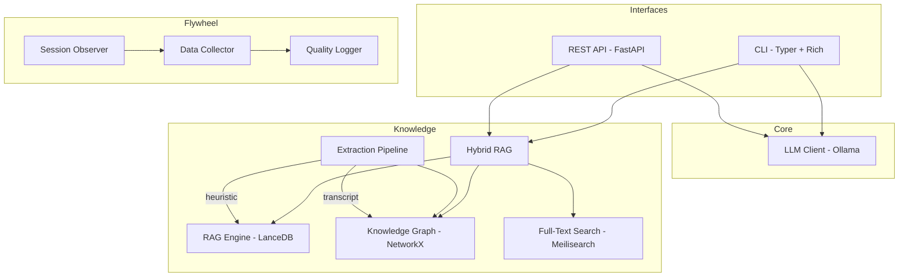
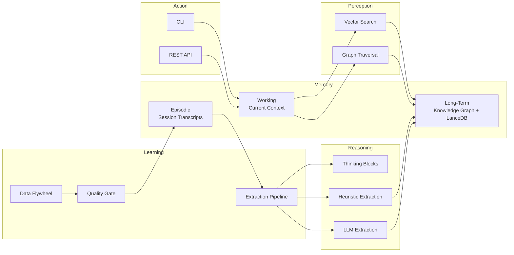

# Fabrik-Codek

**Model-agnostic local AI dev assistant — Claude Code's little brother**

[](https://www.python.org/downloads/)
[](LICENSE)
[]()

Fabrik-Codek is a local AI development assistant that works with **any model via Ollama** (Qwen, Llama, DeepSeek, Codestral, Phi, Mistral...) and combines three-tier hybrid retrieval (vector + knowledge graph + full-text search) to provide context-aware coding assistance. It features a CLI, a REST API, and a continuous data flywheel that improves over time. No vendor lock-in — switch models with a flag.

## Architecture



## Features

- **Model-Agnostic**: Works with any Ollama model — Qwen, Llama, DeepSeek, Codestral, Phi, Mistral, and more. Switch with `--model` or in `.env`
- **Three-Tier Hybrid RAG**: Combines vector search (LanceDB), knowledge graph traversal (NetworkX), and full-text search (Meilisearch) using Reciprocal Rank Fusion (RRF)
- **Knowledge Graph**: Automatically extracts entities and relationships from training data, code changes, and session transcripts
- **Full-Text Search**: Optional Meilisearch integration for BM25-style keyword search — degrades gracefully when unavailable
- **REST API**: FastAPI server with 8 endpoints, API key auth, CORS support, and OpenAPI docs
- **CLI**: Rich terminal interface with interactive chat, single-question mode, and system management commands
- **Data Flywheel**: Continuous learning from interactions — captures prompts, responses, and reasoning for future improvement
- **Session Observer**: Extracts training pairs from Claude Code session transcripts
- **Extraction Pipeline**: 6-step pipeline (training pairs, decisions, learnings, auto-captures, enriched captures, transcripts)
- **Graph Completion**: Infers transitive relationships to densify the knowledge graph
- **Quality-Gated Logger**: Rejects low-quality data to prevent model degradation

## Cognitive Architecture

Fabrik-Codek implements a **cognitive architecture** — a structured system where memory, reasoning, learning, and action work together, much like how a human developer accumulates expertise over time.



| Component | Role | Implementation |
|-----------|------|----------------|
| **Long-term memory** | Accumulated knowledge that persists across sessions | Knowledge Graph (NetworkX) + Vector DB (LanceDB) |
| **Episodic memory** | Records of past interactions and reasoning | Session transcripts + auto-captures |
| **Working memory** | Current conversation context | Prompt + RAG retrieved context |
| **Perception** | Finding relevant knowledge for a query | Hybrid RAG (vector similarity + graph traversal + full-text search) |
| **Learning** | Improving from every interaction | Data Flywheel with quality gate (rejects low-quality data) |
| **Reasoning** | Extracting insights from experience | Thinking block extraction + heuristic/LLM entity extraction |
| **Action** | Interacting with the developer | CLI (Typer + Rich) + REST API (FastAPI) |

Unlike frameworks that only describe cognitive architectures in papers, Fabrik-Codek is a **working implementation** — it captures how you work, builds a knowledge graph from your accumulated experience, and feeds that context back into every query.

## Quick Start

```bash
git clone https://github.com/ikchain/Fabrik-Codek.git
cd fabrik-codek
pip install -e ".[dev]"
fabrik init
```

`fabrik init` checks your Python version, detects Ollama, creates a `.env` config, sets up data directories, and downloads the required models. After that you're ready:

```bash
fabrik chat                    # Interactive chat
fabrik ask "How do I implement a repository pattern?" --rag   # Single question with RAG
fabrik status                  # Check system health
```

> **Prerequisite**: [Ollama](https://ollama.ai/) must be installed and running (`ollama serve`). Fabrik-Codek works with any Ollama model — Qwen, Llama, DeepSeek, Codestral, and more.

## CLI Reference

| Command | Description |
|---------|-------------|
| `fabrik init` | Initialize: check deps, create config, download models |
| `fabrik chat` | Interactive chat with the assistant |
| `fabrik ask "..."` | Ask a single question |
| `fabrik ask "..." --rag` | Ask with vector RAG context |
| `fabrik ask "..." --graph` | Ask with hybrid RAG (vector + graph) |
| `fabrik status` | Check system status (Ollama, RAG, Graph) |
| `fabrik serve` | Start the REST API server |
| `fabrik mcp` | Start as MCP server (stdio) |
| `fabrik mcp --transport sse` | Start as MCP server (SSE, network) |
| `fabrik models` | List available Ollama models |
| `fabrik rag index` | Index the datalake into the vector DB |
| `fabrik rag search -q "..."` | Semantic search in the knowledge base |
| `fabrik rag stats` | Show RAG statistics |
| `fabrik graph build` | Build the knowledge graph |
| `fabrik graph build --include-transcripts` | Build including session transcript reasoning |
| `fabrik graph search -q "..."` | Search entities in the knowledge graph |
| `fabrik graph stats` | Show graph statistics |
| `fabrik graph complete` | Run graph completion (infer transitive relations) |
| `fabrik datalake stats` | Show datalake statistics |
| `fabrik datalake search -q "..."` | Search files in the datalake |
| `fabrik flywheel stats` | Show flywheel status |
| `fabrik flywheel export` | Export training pairs |
| `fabrik fulltext status` | Check Meilisearch connection |
| `fabrik fulltext index` | Index datalake into Meilisearch |
| `fabrik fulltext search -q "..."` | Full-text keyword search |
| `fabrik learn process` | Extract training data from Claude Code sessions |

## API Reference

Start the server with `fabrik serve` (default: `http://127.0.0.1:8420`).

Interactive docs available at `/docs` (Swagger UI) and `/redoc`.

### Endpoints

#### `GET /health`
Liveness probe.
```json
{"status": "ok", "version": "0.1.0", "timestamp": "2026-01-15T10:30:00"}
```

#### `GET /status`
Component status.
```json
{"ollama": "ok", "rag": "ok", "graph": "ok", "fulltext": "ok", "model": "qwen2.5-coder:7b", "datalake": "ok"}
```

#### `POST /ask`
Ask a question with optional RAG/graph context.
```bash
curl -X POST http://localhost:8420/ask \
  -H "Content-Type: application/json" \
  -d '{"prompt": "How do I handle database migrations?", "use_rag": true}'
```
```json
{
  "answer": "For database migrations, I recommend using Alembic with SQLAlchemy...",
  "model": "qwen2.5-coder:7b",
  "tokens_used": 256,
  "latency_ms": 1200.5,
  "sources": [{"source": "training_pair", "category": "postgresql"}]
}
```

#### `POST /chat`
Multi-turn chat with message history.
```bash
curl -X POST http://localhost:8420/chat \
  -H "Content-Type: application/json" \
  -d '{"messages": [{"role": "user", "content": "Explain dependency injection"}]}'
```

#### `POST /search`
Semantic search in the knowledge base.
```bash
curl -X POST http://localhost:8420/search \
  -H "Content-Type: application/json" \
  -d '{"query": "docker networking", "limit": 5}'
```

#### `POST /fulltext/search`
Full-text keyword search via Meilisearch.
```bash
curl -X POST http://localhost:8420/fulltext/search \
  -H "Content-Type: application/json" \
  -d '{"query": "retry backoff", "limit": 5}'
```

#### `POST /graph/search`
Search entities in the knowledge graph.
```bash
curl -X POST http://localhost:8420/graph/search \
  -H "Content-Type: application/json" \
  -d '{"query": "FastAPI", "depth": 2, "limit": 10}'
```

#### `GET /graph/stats`
Knowledge graph statistics.
```json
{
  "entity_count": 245,
  "edge_count": 1820,
  "connected_components": 12,
  "entity_types": {"TECHNOLOGY": 120, "PATTERN": 45, "STRATEGY": 30},
  "relation_types": {"USES": 500, "DEPENDS_ON": 300, "PART_OF": 200}
}
```

### Authentication

Optional API key authentication. Set `FABRIK_API_KEY` in your `.env`:

```bash
# .env
FABRIK_API_KEY=your-secret-key
```

Then include the key in requests:
```bash
# Header
curl -H "X-API-Key: your-secret-key" http://localhost:8420/status

# Bearer token
curl -H "Authorization: Bearer your-secret-key" http://localhost:8420/status
```

The `/health` endpoint is always public (no auth required).

## MCP Server

Fabrik-Codek can run as an [MCP](https://modelcontextprotocol.io/) (Model Context Protocol) server, allowing any compatible agent to use it as a local knowledge base.

### Starting the MCP Server

```bash
# stdio mode (for Claude Code, Cursor, etc.)
fabrik mcp

# SSE mode (for network access)
fabrik mcp --transport sse --port 8421
```

### Configuring in Claude Code

Add to your `~/.claude/settings.json`:

```json
{
  "mcpServers": {
    "fabrik-codek": {
      "command": "fabrik",
      "args": ["mcp"]
    }
  }
}
```

### Available Tools

| Tool | Description |
|------|-------------|
| `fabrik_status` | Check system health (Ollama, RAG, Graph, Datalake) |
| `fabrik_search` | Semantic vector search in the knowledge base |
| `fabrik_graph_search` | Search knowledge graph entities and relationships |
| `fabrik_graph_stats` | Get knowledge graph statistics |
| `fabrik_fulltext_search` | Full-text keyword search via Meilisearch |
| `fabrik_ask` | Ask a question with optional RAG/graph context |

### Available Resources

| URI | Description |
|-----|-------------|
| `fabrik://status` | System component status |
| `fabrik://graph/stats` | Knowledge graph statistics |
| `fabrik://config` | Current configuration (sanitized) |

## Configuration

All settings are configured via environment variables with the `FABRIK_` prefix, or in a `.env` file.

| Variable | Default | Description |
|----------|---------|-------------|
| `FABRIK_OLLAMA_HOST` | `http://localhost:11434` | Ollama server URL |
| `FABRIK_DEFAULT_MODEL` | `qwen2.5-coder:14b` | Default model for generation |
| `FABRIK_FALLBACK_MODEL` | `qwen2.5-coder:32b` | Fallback model |
| `FABRIK_EMBEDDING_MODEL` | `nomic-embed-text` | Model for embeddings |
| `FABRIK_TEMPERATURE` | `0.1` | Generation temperature |
| `FABRIK_MAX_TOKENS` | `4096` | Max tokens per response |
| `FABRIK_DATALAKE_PATH` | `./data` | Path to datalake storage |
| `FABRIK_API_HOST` | `127.0.0.1` | API bind host |
| `FABRIK_API_PORT` | `8420` | API bind port |
| `FABRIK_API_KEY` | _(none)_ | API key (optional) |
| `FABRIK_API_CORS_ORIGINS` | `["*"]` | Allowed CORS origins |
| `FABRIK_FLYWHEEL_ENABLED` | `true` | Enable data collection |
| `FABRIK_VECTOR_DB` | `lancedb` | Vector DB backend |
| `FABRIK_PROJECT_FILTER` | _(none)_ | Filter transcript dirs by project name |
| `FABRIK_MEILISEARCH_URL` | `http://localhost:7700` | Meilisearch server URL |
| `FABRIK_MEILISEARCH_KEY` | _(none)_ | Meilisearch API key (optional) |
| `FABRIK_MEILISEARCH_INDEX` | `fabrik_knowledge` | Meilisearch index name |
| `FABRIK_FULLTEXT_WEIGHT` | `0.0` | Full-text weight in RRF fusion (0.0 = disabled) |
| `FABRIK_LOG_LEVEL` | `INFO` | Log level |
| `FABRIK_LOG_FORMAT` | `console` | Log format (`console` or `json`) |

## Knowledge Graph

The knowledge graph automatically extracts entities (technologies, patterns, strategies) and their relationships from your data.

### Building the Graph

```bash
# Basic build from training data
fabrik graph build

# Include reasoning from Claude Code session transcripts
fabrik graph build --include-transcripts

# Force rebuild from scratch
fabrik graph build --force

# Run graph completion (infer transitive relationships)
fabrik graph complete
```

### Extraction Pipeline

The pipeline processes data in 6 steps:

1. **Training pairs** — Extract from structured QA data
2. **Decisions** — Technical decisions with reasoning
3. **Learnings** — Insights and patterns learned
4. **Auto-captures** — Automatic code change captures
5. **Enriched captures** — Captures enriched with reasoning context
6. **Session transcripts** — Thinking blocks from Claude Code sessions (opt-in)

### Searching the Graph

```bash
# Find entities
fabrik graph search -q "PostgreSQL"

# With deeper traversal
fabrik graph search -q "FastAPI" --depth 3

# View statistics
fabrik graph stats
```

## Data Flywheel

Fabrik-Codek continuously captures data from interactions to improve over time.

### How It Works

1. **Automatic capture**: Every prompt/response pair is captured by the flywheel collector
2. **Quality gating**: The logger rejects low-quality data (reasoning < 100 chars, lessons < 50 chars)
3. **Session learning**: Extract training pairs from Claude Code session transcripts
4. **Graph enrichment**: Build and densify the knowledge graph from all captured data

### Using the Logger

```python
from utils.logger import get_logger

logger = get_logger()

# Log a code change (requires reasoning + lesson)
logger.log_code_change(
    file_modified="src/main.py",
    change_type="updated",
    description="Added error handling for database connection timeouts with retry logic",
    reasoning="The system crashed silently when the database was unreachable. "
              "This caused data loss and poor UX. The fix implements early validation "
              "with clear error messages.",
    lesson_learned="Always validate external connections at system boundaries before processing"
)

# Log an error resolution
logger.log_error(
    error_type="ConnectionError",
    error_message="API timeout after 30s",
    how_fixed="Increased timeout to 60s and added retry with exponential backoff. "
              "The external API had variable latency under load.",
    lesson_learned="External APIs need generous timeouts and retry logic. Never assume constant latency."
)
```

## Project Structure

```
fabrik-codek/
├── src/
│   ├── config/             # Settings (Pydantic BaseSettings)
│   ├── core/               # LLM client (Ollama)
│   ├── interfaces/         # CLI (Typer) + API (FastAPI)
│   ├── knowledge/          # RAG, Knowledge Graph, Extraction Pipeline
│   │   └── extraction/     # Heuristic, LLM, Transcript extractors
│   ├── flywheel/           # Data collection + session observer
│   └── tools/              # Code tools
├── tests/                  # 527 tests
├── scripts/                # Setup, benchmarks, enrichment
├── data/                   # Local data storage
├── prompts/                # Prompt templates
└── docs/plans/             # Architecture design docs
```

## Development

### Running Tests

```bash
# All tests
pytest

# With coverage
pytest --cov=src --cov-report=term-missing

# Specific test file
pytest tests/test_api.py -v
```

### Running the Eval Benchmark

```bash
# Evaluate a model
python scripts/run_eval_benchmark.py --model qwen2.5-coder:7b

# Only one category
python scripts/run_eval_benchmark.py --model qwen2.5-coder:7b --category code-review

# Compare models
python scripts/run_eval_benchmark.py --compare "qwen2.5-coder:7b,qwen2.5-coder:14b"
```

## Works with Any Agent

Fabrik-Codek integrates with any MCP-compatible agent — [Claude Code](https://claude.ai/claude-code), [OpenClaw](https://openclaw.ai/), [Cursor](https://cursor.com/), and more. Run `fabrik mcp` and point your agent at it. The MCP server exposes search, graph traversal, and LLM queries — your accumulated project knowledge available to any tool.

You can also use the REST API directly (`/search`, `/graph/search`, `/ask`) for non-MCP integrations. The data flywheel captures how *you* work, and any agent can tap into that knowledge.

### OpenClaw Integration

Fabrik-Codek is available as an [OpenClaw skill on ClawHub](https://clawhub.com). Install it with:

```
/install fabrik-codek
```

Or configure manually in your `openclaw.json`:

```json
{
  "mcpServers": {
    "fabrik-codek": {
      "command": "fabrik",
      "args": ["mcp"]
    }
  }
}
```

The skill exposes all 5 MCP tools to your OpenClaw agent. See [`skills/fabrik-codek/SKILL.md`](skills/fabrik-codek/SKILL.md) for details.

## Contributing

Contributions are welcome! Please:

1. Fork the repository
2. Create a feature branch (`git checkout -b feat/my-feature`)
3. Write tests for new functionality
4. Ensure all tests pass (`pytest`)
5. Submit a pull request

## License

[MIT](LICENSE)
